# AWS AMI Automated Creation & Deletion System
A simple AWS lambda project to help automate creation and deletion of AMIs. The scripts are written in JavaScript and will run on the the serverless AWS Lambda platform.

## Motivation
Creating an AMI automatically snapshots all the associated EBS volumes for that instance. This makes instance recovery much more reliable and faster. A daily or weekly backup schedule is recommended for instances and to make sure you have a backup if ever needed. The system also removes the automatically created AMIs and any associated snapshots as per the settings.

Update 31 March 2017 - Added feature to prevent reboot while creating AMI. Add a tag BackupNoReboot with value true if want to avoid rebooting that instance.  
Update December 2018 - Replaced screenshots to reflect AWS Console changes.

## Setup / Installation of the Lambda script

1) Go to the [AWS Lambda Console](https://console.aws.amazon.com/lambda) and click _Create function_.  
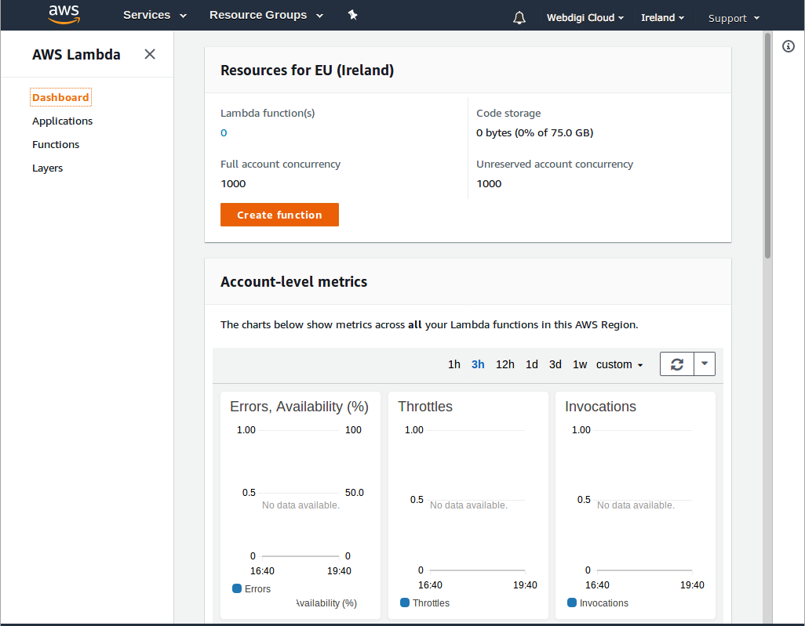

2) Name the function and select _Create a custom role_.  
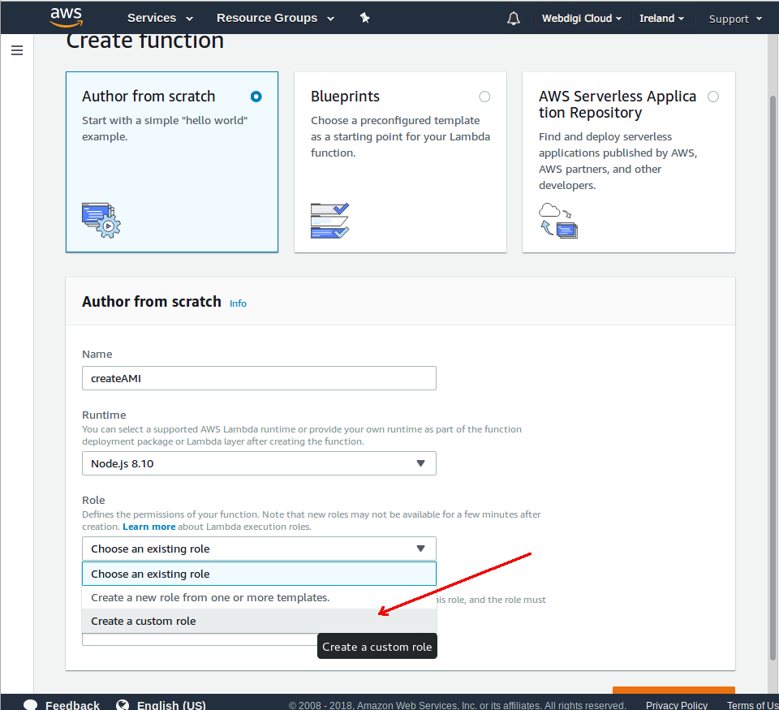

3) Give the custom role a name and paste the contents of [roles.json](./roles/roles.json) into the edit box.
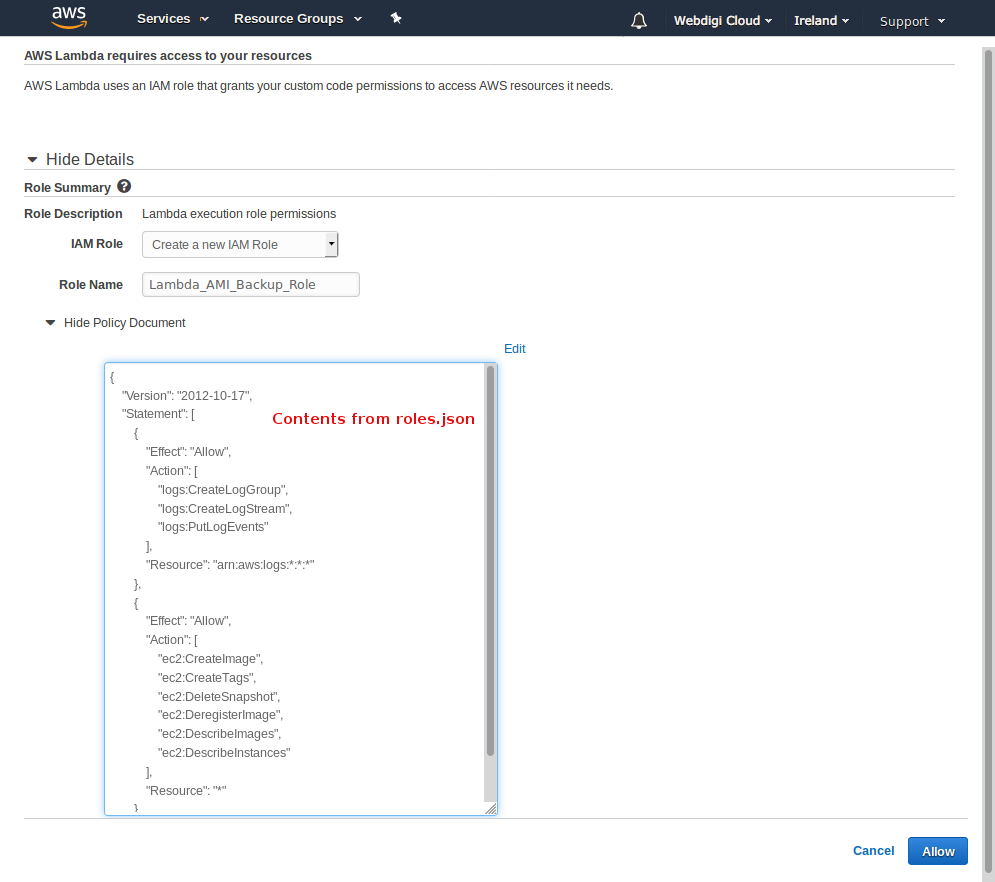

4) Now the function has been created, and you'll be presented with the lambda configuration screen.
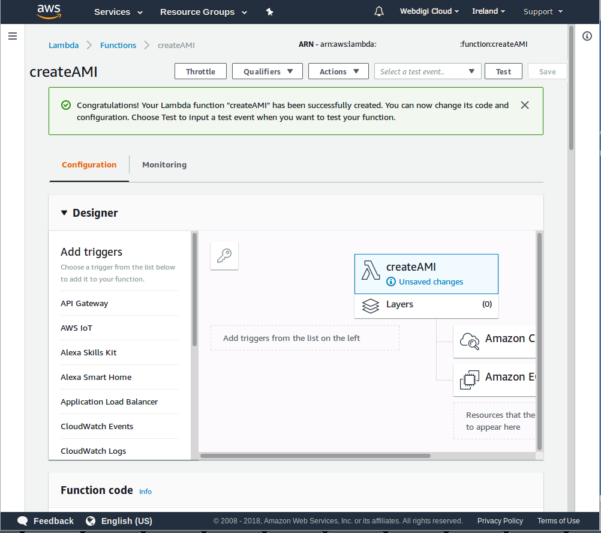

5) Scroll down to the code editor, and remove the stub code you see in the editor.
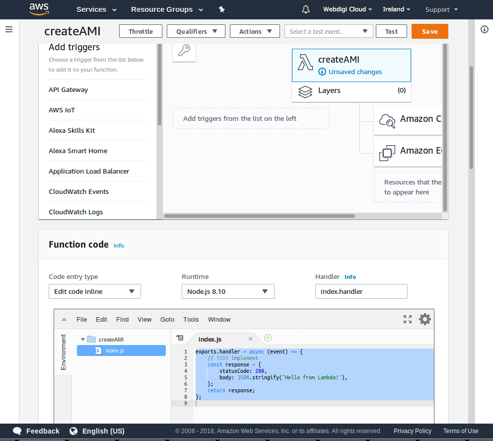

6) Paste the contents of [createAMI.js](./lambda/createAMI.js) into the edit box.  
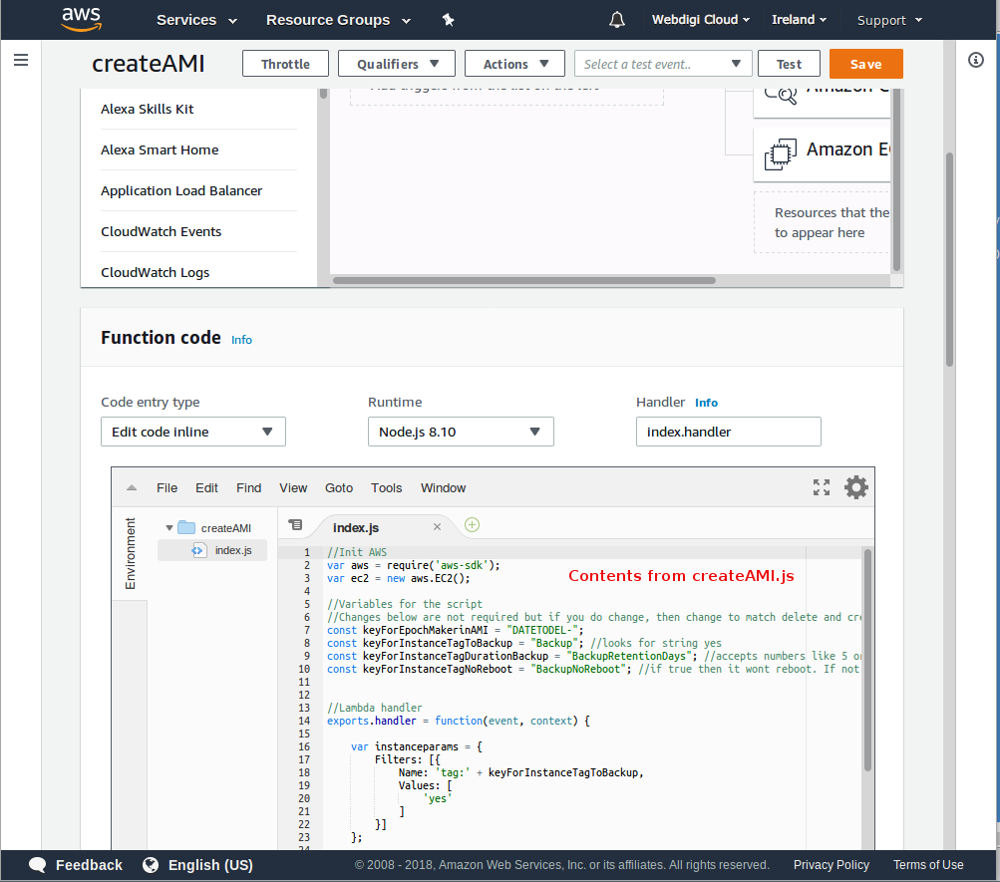

7) Scroll down further and modify the *Basic Settings*.  
Provide a description and set the timeout to 5 minutes.  
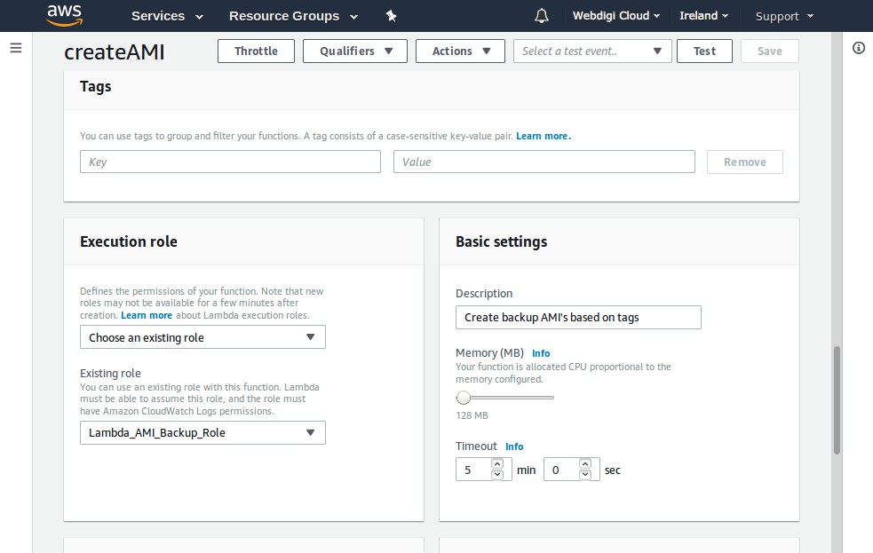

8) Scroll back to the top and click _Save_.  
Add a trigger by selecting _CloudWatch Event_.  
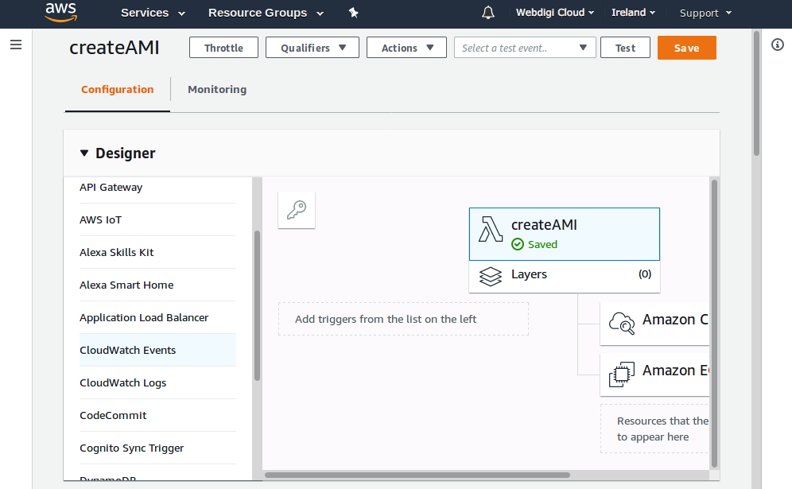

9) To set up the trigger select _Create a new rule_.  
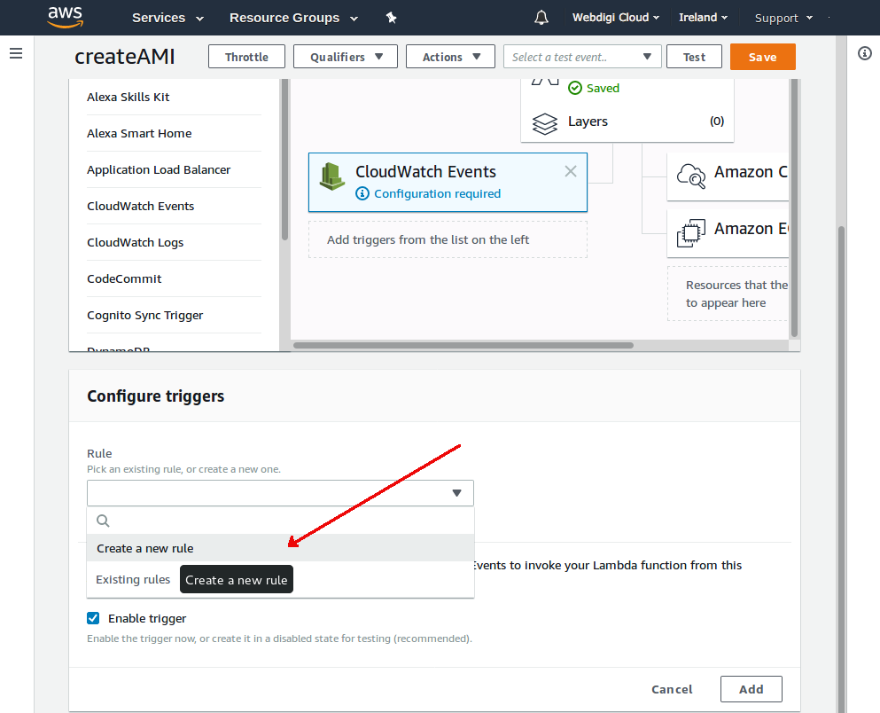

10) Configure the Rule:
* Provide a rule name and description.
* Set the event pattern or schedule.
  * The cron expression showed below will run at 2AM every day.
* Finish by clicking _Add_ at the bottom.  

11) Success!  
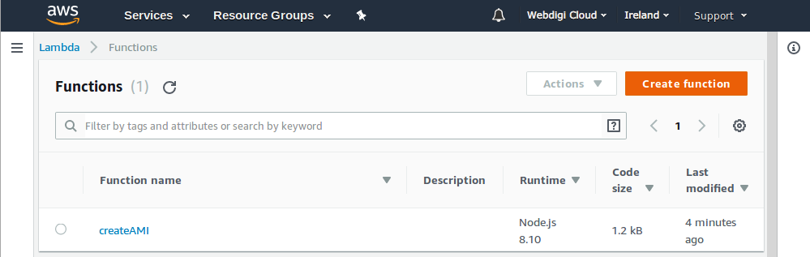

12) Create a second function named deleteAMI.  
Follow the same basic steps as above, but this time:
* Use [deleteAMI.js](./deleteAMI.js)
* Use the existing lambda Role.
* Use the existing CloudWatch Rule.

## Setting the tags for EC2 instances  

Set the tags on the instances you want backed up.  
* **Backup**: yes 
* **BackupRetentionDays**: a positive integer
* **BackupNoReboot**: true (this tag is optional - reboot will happen unless the tag is present and value is true)

For multiple instances it is easiest to use the Tag Editor.  
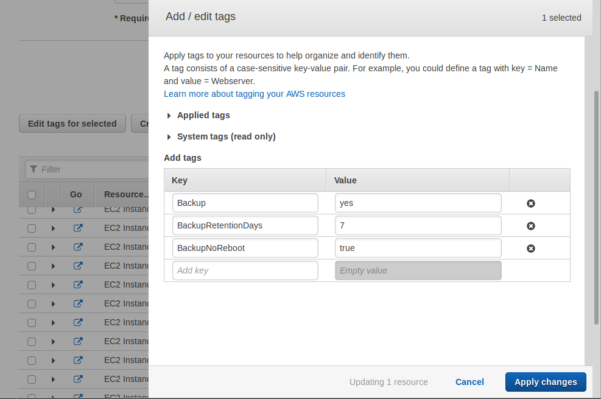

## Notes

- This is another open source project bought to you by [Webdigi - Web development, London](https://www.webdigi.co.uk/).
- Please submit your pull requests or suggestions to improve this script.
- You can read about updates to this project on our blog - [AWS Instance Automated AMI Creation & Deletion System](https://www.webdigi.co.uk/blog/2017/aws-instance-automated-ami-creation-deletion-system/)
